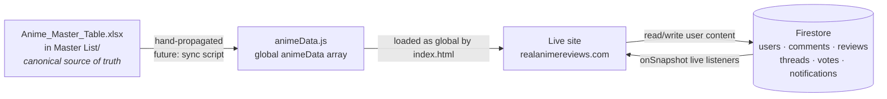

# Architecture

How the pieces of Real Anime Reviews fit together. The high-level shape: a static site reads from a hand-maintained anime database (`animeData.js`), renders a UI that talks to Firestore for everything user-generated, and is deployed via Firebase Hosting.

## Data flow



**The flow in plain English:**

1. Blake maintains anime entries in `Anime_Master_Table.xlsx` (lives outside the repo, in `Master List/`).
2. Entries get hand-copied into `animeData.js` as a global `animeData` array. Automating this is on the [ROADMAP](../ROADMAP.md#big-vision-ideas).
3. `index.html` loads `animeData.js` as a regular `<script>` tag, making the array available globally to `script.js`.
4. `script.js` renders cards, modal, search, filters, etc., all from that array.
5. For anything user-generated (comments, reviews, votes, favorites, watchlist, notifications), the site talks to Firestore directly via the Firebase Web SDK.
6. Firestore pushes live updates back to the site via `onSnapshot` listeners — that's why comments and vote counts update without a page refresh.

---

## File structure

Top of the repo (`Current Version/`):

| File / folder | Role |
|---|---|
| `index.html` | Main page — header, card grid, anime detail modal (left = Blake's review, right = community tab), auth modal, profile modal, notification dropdown |
| `account.html` | Account page — 4 tabs (Profile, Watchlist, Favorites, Activity) |
| `404.html` | Firebase Hosting fallback page |
| `style.css` | Desktop styling |
| `mobile.css` | Mobile overrides, loaded via `@media (max-width: 900px)` |
| `animeData.js` | Global `animeData` array — every anime entry. Plain JS, no module exports. |
| `script.js` | All main-page logic — single IIFE, ~4,000 lines, ~21 sections |
| `account.js` | Account page logic — ES module |
| `firebase.js` | Initializes Firebase v12.2.1 and exports `app`, `auth`, `db` — ES module |
| `firebase.json` | Firebase Hosting config (public dir, rewrites, ignores) |
| `.firebaserc` | Pins deploy target to project ID `real-anime-reviews` |
| `.gitignore` | Git exclusions (Firebase cache, editor state, `PERSONAL.md`, `.env*`) |
| `assets/` | Cover art (49 files), placeholder, Instagram icon, preview image, `avatars/` subfolder |
| `UpdateLog/` | Blake's working notes (currently `RealAnimeReviewsUpdateLog.docx`) |
| `docs/` | This directory — ARCHITECTURE.md, DEPLOYMENT.md |

Doc files in repo root: `README.md`, `CHANGELOG.md`, `ROADMAP.md`, and (gitignored) `PERSONAL.md`.

---

## Code organization

### `script.js` (~4,000 lines)

Wrapped in a single IIFE to avoid leaking globals. Has ~21 section banners (`// ---------- NAME ----------`) that map to functional areas:

| Section | What lives there |
|---|---|
| **Firebase imports** | ES module imports for `firebase-firestore` and `firebase-auth` |
| **DOM HOOKS** | All `document.getElementById(...)` calls hoisted to the top |
| **STATE** | Module-level state vars (favorites set, watchlist set, spotlight index, etc.) |
| **UTIL** | `slug()`, `escapeHtml()`, `shuffle()`, `toYouTubeEmbedSrc()`, etc. |
| **AUTH MODAL** | Sign-in / sign-up / password reset modal logic |
| **SEARCH** | `matchesSearch(anime, q)` |
| **FILTERS** | Genre / tag / studio facet filter UI + `matchesFilters(anime, f)` |
| **GRID + CARDS** | `createCard(anime)`, `renderGrid()` |
| **FEATURED (Latest Review)** | `buildFeaturedDrop()` — the "LATEST ANIME DROP!" card on the home page |
| **SPOTLIGHT (Top 10)** | `buildSpotlight()`, auto-cycle timer, prev/next controls |
| **RECOMMENDED RAIL** | `mountRail(genre, direction)` — the auto-scrolling "Anime by Genre" carousel |
| **COMMENTS** | `subscribeComments(anime)`, `wireComments(anime)` — per-anime comments + voting + edit/delete |
| **MODAL** | `openModal(anime)`, `closeModal()` — assembles the dual-sheet detail view |
| **VIEWS** | `showHome()`, `showAll()` — switches between home and full-grid views |
| **WIRES** | Top-level event listener bindings |
| **INIT** | `init()` — bootstraps everything on load |

Community reviews + discussion threads + official-rating votes have their own subsections (`wireCommunity()`, `wireOfficialVotes()`) — they're substantial enough that they read like their own modules even though they're inline.

### `account.js` (~780 lines)

ES module, simpler than `script.js`. Key functions:

- `activateTab(name)` — switches between Profile / Watchlist / Favorites / Activity tabs
- `subscribeSavedLists(user)` — live listeners for favorites + watchlist
- `subscribeActivity(user)` — merges `collectionGroup('items')` + `collectionGroup('threads')` queries (this is what needs the composite indexes)
- `subscribeNotifications(user)` — notification inbox
- `downscaleImage(file, max=512)` + the upload pipeline — avatar upload flow (resizes to 512px max, uploads to Firebase Storage at `avatars/{uid}/profile.{ext}`)

### `firebase.js` (30 lines)

One job: initialize Firebase v12.2.1 with the public web config and export `app`, `auth`, `db`. The web API key is intentionally public (security comes from Firestore rules, not key secrecy).

---

## Firestore data model

Five collection families:

### 1. User profiles + per-user lists

```
/users/{uid}                           — profile doc (displayName, photoURL)
/users/{uid}/favorites/{animeId}       — favorited anime
/users/{uid}/watchlist/{animeId}       — watchlist anime
/users/{uid}/notifications/{notifId}   — notifications inbox
```

Owner-only read/write. Notifications are pruned to the newest 10 client-side.

### 2. Comments (under Blake's official anime modal)

```
/comments/{animeId}/items/{commentId}
/comments/{animeId}/items/{commentId}/votes/{voterUid}    — value: 1 or -1
```

Public read. Signed-in create. Author-only edit/delete.

### 3. Community reviews (one per user per anime)

```
/reviews/{animeId}/items/{reviewerUid}                        — doc ID == reviewer UID (enforces 1-per-user)
/reviews/{animeId}/items/{reviewerUid}/votes/{voterUid}       — votes on the review
/reviews/{animeId}/items/{reviewerUid}/threads/{tid}          — discussion comments under the review
/reviews/{animeId}/items/{reviewerUid}/threads/{tid}/votes/{voterUid}  — votes on the discussion comments
```

Using the UID as the doc ID makes "does this user already have a review?" trivially answerable without a query.

### 4. Official rating votes (the "Agree with my Rating?" widget)

```
/official/{animeId}                       — aggregate (likesCount, dislikesCount)
/official/{animeId}/votes/{voterUid}      — each user's vote (value: 1 or -1)
```

By design, official-rating votes do **not** generate notifications and do **not** appear in the activity feed.

### 5. Required composite indexes

Two collection-group indexes power the My Activity feed in `account.js`:

- Collection group **`items`** → `uid ASC + createdAt DESC`
- Collection group **`threads`** → `uid ASC + createdAt DESC`

If activity ever returns "query requires an index" in the console, click the link Firebase provides and let it auto-create. If you ever recreate the Firebase project, you have to recreate these manually.

---

## Notable quirks and lessons

### Runtime version-tag rewrite

`script.js:37–40` runs on `DOMContentLoaded` and overwrites `#changelog-version` with `` `v${window.APP_VERSION}` ``:

```javascript
document.addEventListener("DOMContentLoaded", () => {
  const el = document.getElementById("changelog-version");
  if (el && window.APP_VERSION) el.textContent = `v${window.APP_VERSION}`;
});
```

This means **the static HTML can be different from what users see post-JS**. We discovered this during the v1.3.4 cleanup — the static fallback in `index.html` was stuck at `v1.0.1` even though the live site showed `v1.3.4` (because `APP_VERSION = "1.3.4"` and the JS overwrites the tag).

**Lesson:** Keep static fallbacks in sync with what JS will render. Users with JS disabled (or slow JS load) only see the static content.

### HTML quote-convention split

`index.html` has two quote conventions intentionally:

- **HTML attributes** use straight ASCII `"` (required by the HTML spec; curly quotes break attribute parsing)
- **Decorative text content** uses curly typographic `"..."` (e.g., `"Anime by Genre"`, `"My Top 10"`)

Both conventions are valid in their contexts, but if you ever search/replace by quote character, you need to be deliberate about which one. The Read tool in some terminals renders both as straight, which can hide the distinction — verify with byte-level inspection if it matters.

### One review per user per anime

Enforced by using `request.auth.uid` as the doc ID at `/reviews/{animeId}/items/{uid}`. Two side effects worth knowing:

1. The "do I already have a review?" check is a `getDoc(doc(...))` instead of a query.
2. If a user deletes their review and re-creates it, the existing `/threads/` subcollection is **not** automatically wiped. Firestore client SDK doesn't cascade-delete subcollections — see the [ROADMAP "Cloud Function for cascading deletes"](../ROADMAP.md#polish--tech-debt) item.

### Featured Drop = last entry in animeData

The "LATEST ANIME DROP!" card on the home page (`script.js:1054–1073`, `buildFeaturedDrop()`) picks `animeData[animeData.length - 1]` — the LAST entry in the array. So when Blake adds a new anime, he just appends it to `animeData.js` and it becomes the featured drop automatically. No manual "set featured" toggle.